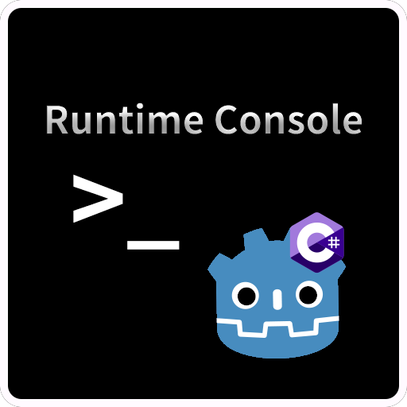

# RuntimeConsole 插件（Godot 游戏内控制台）

**[简体中文](README.md) | [English](README_en.md)**



## 概述
RuntimeConsole 是一个适用于 Godot .NET 4.4+ 的运行时控制台插件，允许开发者在游戏运行中执行命令、查看日志，并通过对象检查器实时调试场景中的节点和数据结构，为开发与测试带来极大便利

## 功能

运行时查看日志

运行时查看对象属性

运行时执行命令

自由扩展控制台功能窗口

## 环境要求

- [Godot .NET 4.4+](https://godotengine.org/download/windows/)

## 安装

1. 下载`Release`版本并解压到项目中。

2. 在 `Project Settings > Plugins` 中启用插件。


## 自定义命令

### 添加自定义命令

你可以通过 C# 或 GDScript 添加自定义控制台命令。所有命令需实现 [`IConsoleCommand`](/LogAndCommandWindow/CommandComponent/Interface/IConsoleCommand.cs) 接口（C#）或对应的 GDScript 接口结构。

**GDScript 脚本** 需实现以下方法，方法签名必须与接口一致，**必须使用类型提示**：
    
- `get_keyword() -> String` 或 只读属性`keyword`（匿名 getter）

- `get_parameter_types() -> Array[Variant.Type]` 或 只读属性 `parameter_types`（匿名 getter）

- `execute(Array) -> void`

你可以使用插件提供的[命令模板](/LogAndCommandWindow/CommandComponent/GDScriptInterfaceTemplate/command_template.gd)来快速创建一个命令：
```gdscript
# Implement IConsoleCommand 
extends Resource

var keyword: String:
	get:
		return "" # Replace with your command keyword

var parameter_types: Array[Variant.Type]:
	get:
		return [] # Replace with the expected parameter types (in order)

func execute(args: Array) -> void:
	pass # Replace with your command logic
```

C# 脚本 需继承自任意 Godot 类型，并实现 `IConsoleCommand` 接口。

> 💡 注意：所有命令脚本文件需放置在插件配置的`CommandPath`对应目录下（默认为`LogAndCommandWindow/CommandComponent/Commands`）保存后命令会自动加载，无需手动注册。  
> 你可以编辑插件配置文件(`Config/config.tres`)来更改默认目录

---

### 添加自定义参数解析器

你也可以通过 C# 或 GDScript 添加自定义命令参数解析器。所有解析器需实现 [`IParameterParser`](/LogAndCommandWindow/CommandComponent/Interface/IParameterParser.cs) 接口（C#）或对应的 GDScript 接口结构。

> **⚠️ 注意：一个 Variant.Type 只能绑定一个解析器。多个解析器解析相同类型会导致冲突。**

GDScript 脚本需要实现以下方法，方法签名必须与接口一致，必须要使用类型提示：

- `get_supported_types() -> Array[Variant.Type]` 或 只读属性`supported_types`（匿名getter）

- `get_result() -> Variant` 或 只读属性`result`（匿名getter）

- `parse(String) -> Error`

你可以使用插件提供的[解析器模板](/LogAndCommandWindow/CommandComponent/GDScriptInterfaceTemplate/parameter_parser_template.gd)来快速创建一个解析器：
```gdscript
# Implement IParameterParser
extends Resource

var supported_types : Array[Variant.Type]:
    get:
        return [] # Replace with the types supported by this parser

var result : Variant:
    get:
        return _result

var _result : Variant

func parse(token: String) -> Error:
    # Replace with your parsing logic
    return OK
```

C# 脚本需继承自任意的`Godot`类型，并实现`IParameterParser`接口。

> 💡 注意：所有参数解析器脚本文件需放置在插件配置的`ParameterParserPath`目录下（默认为`LogAndCommandWindow/CommandComponent/ParameterParser`）。保存后解析器会自动加载，无需手动注册。   
> 你可以编辑插件配置文件(`Config/config.tres`)来更改默认目录

## 添加自定义控制台窗口

1. 新建一个场景并附加脚本，场景根节点必须为 `Window`，脚本也必须继承 `Window`（可使用 GDScript 编写）

2. 按需添加功能与 UI 元素

3. 打开插件配置文件 `Config/config.tres`，在 `Window Settings` 属性中新增一个元素：

    - `Key`：窗口按钮显示的文本

    - `Window`：绑定刚刚创建的场景

    - 勾选 `Enabled` 启用该窗口

4. 保存配置，插件会自动加载并显示该窗口

## 许可证

[`MIT`](https://mit-license.org/) License