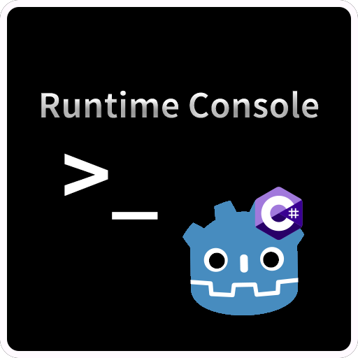

# RuntimeConsole Plugin (In-Game Console for Godot)

**[简体中文](README.md) | [English](README_en.md)**



## Overview
RuntimeConsole is a runtime console plugin for Godot .NET 4.4+ that allows developers to execute commands, view logs, and debug scene nodes and data structures in real-time during gameplay, providing great convenience for development and testing.

## Features

View logs at runtime

Inspect object properties at runtime

Execute commands at runtime

Freely extend console feature windows

## Requirements

- [Godot .NET 4.4+](https://godotengine.org/download/windows/)

## Installation

1. Download the `Release` version and extract it into your project.

2. Enable the plugin in `Project Settings > Plugins`.

## Custom Commands

### Adding Custom Commands

You can add custom commands using **C#** or **GDScript**.
All commands must implement the [`IConsoleCommand`](/LogAndCommandWindow/CommandComponent/Interface/IConsoleCommand.cs) interface (for C#) or the corresponding GDScript structure.

**GDScript scripts** must implement the following methods.
Function signatures must exactly match the interface, and **type hints are required**:

- `get_keyword() -> String` or a read-only property `keyword` (anonymous getter)

- `get_parameter_types() -> Array[Variant.Type]` or a read-only property `parameter_types` (anonymous getter)

- `execute(Array) -> void`

You can use the provided [`command template`](/LogAndCommandWindow/CommandComponent/GDScriptInterfaceTemplate/command_template.gd) to create a new command easily:

```gdscript
# Implement IConsoleCommand 
extends Resource

var keyword: String:
	get:
		return "" # Replace with your command keyword

var parameter_types: Array[Variant.Type]:
	get:
		return [] # Replace with the expected parameter types (in order)

func execute(args: Array) -> void:
	pass # Replace with your command logic
```

**C# scripts** should inherit from any `Godot` type and implement the `IConsoleCommand` interface.

> 💡 Note: All command scripts must be placed in the plugin configuration `CommandPath ` directory (the default is ` LogAndCommandWindow CommandComponent/Commands `).  Once saved, commands will be loaded automatically — no manual registration is needed.  
> You can edit the plugin configuration file (`Config/config.tres`) to change the default directory

---

### Adding Custom Parameter Parsers

You can also create **custom argument parsers** for your commands using either **C#** or **GDScript**.
All parsers must implement the [`IParameterParser`](/LogAndCommandWindow/CommandComponent/Interface/IParameterParser.cs) interface (C#) or the equivalent GDScript structure.

> ⚠️ Each Variant.Type can only be handled by one parser.   
> Defining multiple parsers for the same type will result in conflicts.

**GDScript scripts** must implement the following methods.
Function signatures must exactly match the interface, and **type hints are required**:

- `get_supported_types() -> Array[Variant.Type]` or a read-only property `supported_types` (anonymous getter)

- `get_result() -> Variant` or a read-only property `result` (anonymous getter)

- `parse(String) -> Error`

You can use the provided [`parser template`](/LogAndCommandWindow/CommandComponent/GDScriptInterfaceTemplate/parameter_parser_template.gd) to quickly create a custom parser:

```gdscript
# Implement IParameterParser
extends Resource

var supported_types : Array[Variant.Type]:
    get:
        return [] # Replace with the types supported by this parser

var result : Variant:
    get:
        return _result

var _result : Variant

func parse(token: String) -> Error:
    # Replace with your parsing logic
    return OK
```

**C# scripts** should inherit from any `Godot` type and implement the `IParameterParser` interface.

> 💡 Note: All parser scripts must be placed in the plugin configuration ` ParameterParserPath ` directory (the default is ` LogAndCommandWindow CommandComponent/ParameterParser `). 
> Parsers will be loaded automatically — no manual registration required.  
> You can edit the plugin configuration file (`Config/config.tres`) to change the default directory

## Creating a Custom Console Window

1. Create a new scene whose root node is of type `Window`, and attach a script that inherits from `Window`.
(You can use GDScript to write this script.)

2. Implement your desired features in the window.

3. Edit the plugin config file: `Config/config.tres`.
Under the `Window Settings` section, add a new element:

    - `Key`: The label for the window button

    - `Window`: Assign the scene you just created

    - Check `Enabled` to make the window available

4. Save the configuration. The plugin will load your custom window automatically.

## License

[`MIT`](https://mit-license.org/) License
